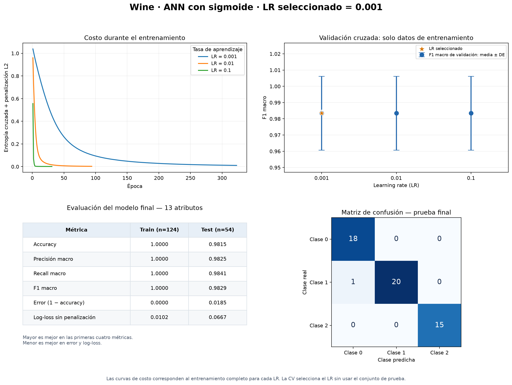
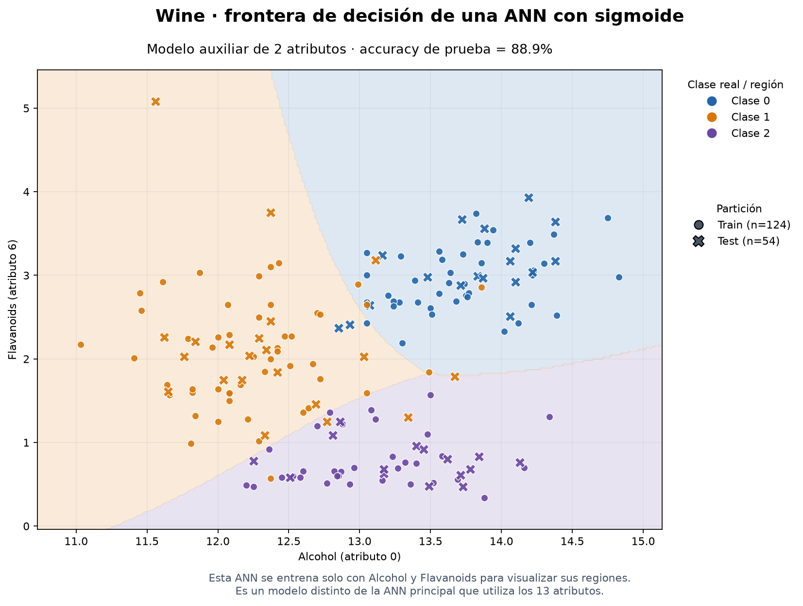

# Ejercicio 9: red neuronal artificial para Wine

Este ejercicio entrena una ANN para reconocer las tres clases del dataset Wine.
Combina una partición estratificada 70/30, validación cruzada, activación
sigmoide y una comparación de tasas de aprendizaje. El ejecutable es
[`ann_wine.py`](ann_wine.py); las figuras se generan en
[`ann_wine_visualization.py`](ann_wine_visualization.py).

## Ejecutar

Desde la carpeta del proyecto, con las dependencias ya instaladas:

```powershell
# Entrenar, imprimir resultados y abrir las dos figuras
.\.venv\Scripts\python.exe ann_wine.py

# Guardar resultados sin abrir ventanas
.\.venv\Scripts\python.exe ann_wine.py --no-gui

# Cambiar las tasas candidatas y el tamaño de la capa oculta
.\.venv\Scripts\python.exe ann_wine.py --learning-rates 0.001 0.005 0.01 --hidden-units 24 --no-gui
```

Wine está incluido en scikit-learn: este ejercicio funciona sin descargar una
base externa. Si falta el entorno, siga la [instalación general](README.md#instalación).

## Datos y evaluación

Wine contiene 178 muestras, 13 atributos numéricos y tres clases de cultivar.
La semilla predeterminada es 42. El procedimiento conserva una prueba final
separada de la selección de hiperparámetros:

1. Separar el 70 % de entrenamiento y el 30 % de prueba con estratificación:
   124 y 54 muestras, respectivamente.
2. Dividir únicamente las 124 muestras de entrenamiento mediante
   `StratifiedKFold(n_splits=5, shuffle=True, random_state=42)`.
3. Comparar `0.001`, `0.01` y `0.1` usando exactamente los mismos pliegues.
   Cada ajuste aprende su propio `StandardScaler` dentro del pipeline.
4. Elegir la tasa con mayor F1 macro medio de validación. Un empate exacto
   se resuelve a favor de la tasa menor.
5. Evaluar el modelo de la tasa elegida, ajustado con las 124 muestras,
   en las 54 muestras reservadas.

La partición 70/30 es un holdout; los cinco pliegues constituyen la validación
cruzada. Las muestras de prueba no intervienen en el escalado, los pesos ni la
elección de la tasa. La CV sí participa en esa elección: su resultado ganador
no debe interpretarse como una estimación independiente del ajuste de
hiperparámetros. Véase la [guía de validación cruzada de scikit-learn](https://scikit-learn.org/stable/modules/cross_validation.html).

## Arquitectura y activación

La red principal es:

```text
13 atributos → StandardScaler → 16 neuronas sigmoides → 3 salidas softmax
```

La capa oculta aplica `sigmoide(z) = 1 / (1 + exp(-z))`, llamada `logistic`
en `MLPClassifier`. Softmax se usa en la salida porque cada muestra pertenece
a una sola de las tres clases: sus probabilidades suman uno y la predicción
es la clase de mayor probabilidad. En este ejercicio la sigmoide se aplica
a la capa oculta y softmax a la salida multiclase.

La red es **totalmente conectada entre capas consecutivas**: cada una de las
13 entradas conecta con las 16 neuronas ocultas, y cada neurona oculta conecta
con las tres salidas. Así, cada entrada puede influir en cada clase a través
de la capa oculta; no hay conexiones directas de entrada a salida.

| Componente | Dimensiones | Cantidad |
|---|---|---:|
| Pesos de entrada a oculta, `W1` | `13 × 16` | 208 |
| Pesos de oculta a salida, `W2` | `16 × 3` | 48 |
| Sesgos ocultos, `b1` | `16` | 16 |
| Sesgos de salida, `b2` | `3` | 3 |
| Total de parámetros entrenables | 256 pesos + 19 sesgos | **275** |

Para una muestra, la propagación hacia adelante es:

```text
x_scaled = (x - media_train) / escala_train
h = sigmoid(x_scaled @ W1 + b1)
p = softmax(h @ W2 + b2)
clase_predicha = argmax(p)
```

`@` representa multiplicación matricial. `x` tiene 13 valores, `h` tiene 16
y `p` contiene las tres probabilidades. El escalador aprende medias y escalas
solo del entrenamiento y no se actualiza mediante backpropagation.

| Parámetro | Configuración predeterminada |
|---|---|
| Capa oculta | 16 neuronas, una capa |
| Activación oculta | `logistic` (sigmoide) |
| Optimizador | Adam |
| Regularización L2 | `alpha=0.0001` |
| Tamaño de lote | 16 muestras |
| Máximo de épocas | 2 000 |
| Tolerancia | `tol=0.0001` |
| Paciencia | `n_iter_no_change=20` |
| Validación interna para early stopping | Desactivada: `early_stopping=False` |

Aunque `early_stopping=False`, Adam puede terminar antes de las 2 000 épocas
por falta de mejora suficiente del costo de entrenamiento. No se reserva un
subconjunto interno adicional para detenerse por su accuracy. La referencia
de parámetros es [MLPClassifier](https://scikit-learn.org/stable/modules/generated/sklearn.neural_network.MLPClassifier.html).

## Función de costo y error

El entrenamiento minimiza entropía cruzada más una penalización L2 sobre los
pesos. Para una muestra de clase real `c`, la parte de entropía cruzada es
`-log(p_c)`: penaliza especialmente predecir con mucha confianza una clase
incorrecta. L2 desincentiva pesos grandes.

El programa distingue tres cantidades:

- **Costo de entrenamiento:** valores de `loss_curve_`, con entropía cruzada
  y regularización, registrados durante la optimización por mini-batches.
- **Log-loss de evaluación:** entropía cruzada calculada con las probabilidades
  finales sobre un conjunto completo; no incorpora la penalización L2.
- **Error de clasificación:** `1 - accuracy`, proporción de etiquetas erradas.

El error de clasificación no es la función usada para actualizar los pesos.
Dos modelos pueden acertar las mismas etiquetas y tener log-loss diferente
porque asignan probabilidades distintas. Aquí no se emplea error cuadrático
medio como costo de clasificación.

## Cómo se iteran los pesos

Cada mini-batch recorre la red y produce probabilidades. Se calcula el costo;
backpropagation obtiene sus gradientes respecto a `W1`, `b1`, `W2` y `b2`.
Adam usa esos gradientes y sus estimaciones acumuladas para actualizar pesos
y sesgos. El siguiente lote usa los parámetros ya actualizados. Una época
completa recorre todas las muestras de entrenamiento, y el proceso se repite
hasta satisfacer el criterio de parada o llegar al máximo de épocas.

Con 124 muestras y lotes de 16 hay `ceil(124 / 16) = 8` actualizaciones por
época: siete lotes de 16 y uno de 12. El modelo principal seleccionado realizó
323 épocas, equivalentes a **2 584 actualizaciones**. Esta cantidad corresponde
a ese ajuste final; no suma los entrenamientos de CV, las otras tasas ni la
red auxiliar de la frontera. `--max-iter 2000` establece el máximo de épocas,
no el máximo de actualizaciones. Los parámetros entrenados se exportan para
poder inspeccionar todas las conexiones.

## ¿Qué hace el learning rate?

La tasa de aprendizaje controla la escala de las actualizaciones de pesos.
Una tasa pequeña suele necesitar más épocas; una demasiado grande puede
generar oscilaciones o dificultar el aprendizaje. Adam adapta las
actualizaciones mediante estimaciones del gradiente y su variabilidad.

En este ejercicio se modifica `learning_rate_init`, la tasa inicial de Adam.
El parámetro de scikit-learn llamado `learning_rate` define esquemas para SGD
y no es el que se compara aquí. Consulte la [referencia del estimador](https://scikit-learn.org/stable/modules/generated/sklearn.neural_network.MLPClassifier.html).

Todas las curvas de costo proceden del entrenamiento con 124 muestras. La
tasa se selecciona por F1 macro de CV, no por rapidez, costo final o resultados
del conjunto de prueba.

## Resultados reproducibles

Ejecución con las opciones predeterminadas y semilla 42:

| Tasa inicial | Accuracy CV | F1 macro CV, media ± desv. | Épocas medias en CV |
|---:|---:|---:|---:|
| 0.001 | 98,40 % | 98,34 % ± 2,27 puntos | 371,0 |
| 0.01 | 98,40 % | 98,34 % ± 2,27 puntos | 102,6 |
| 0.1 | 98,40 % | 98,34 % ± 2,27 puntos | 33,2 |

Las tres tasas empatan exactamente en F1 macro medio. Se selecciona **0.001**
por la regla de desempate, no porque se haya demostrado superioridad de esa
tasa. Las tasas mayores necesitaron menos épocas en esta ejecución; esto no
garantiza que sean mejores en otros datos o semillas. Ningún pliegue alcanzó
el límite de 2 000 épocas. La desviación reportada es muestral (`ddof=1`), no
un intervalo de confianza.

El modelo seleccionado entrenó durante 323 épocas con las 124 muestras.
Su accuracy de entrenamiento fue 100 %. En la prueba final:

| Métrica | ANN principal, 13 atributos |
|---|---:|
| Aciertos | 53 de 54 |
| Accuracy | 98,15 % |
| Error de clasificación | 1,85 % |
| Precisión macro | 98,25 % |
| Recall macro | 98,41 % |
| F1 macro | 98,29 % |
| Log-loss | 0,0667 |

La matriz de confusión usa filas reales y columnas predichas:

```text
              Cultivar 1  Cultivar 2  Cultivar 3
Cultivar 1        18           0           0
Cultivar 2         1          20           0
Cultivar 3         0           0          15
```

Las métricas macro otorgan el mismo peso a cada clase. El único error fue
una muestra de cultivar 2 clasificada como cultivar 1. Esta prueba contiene
solo 54 muestras: cada error cambia el accuracy aproximadamente 1,85 puntos.
El resultado corresponde a esta partición; no implica un 98,15 % garantizado
en datos nuevos.



## Frontera de decisión

Una imagen plana no representa directamente las 13 entradas. Para visualizar
la separación se entrena otra ANN usando **alcohol (índice 0)** y
**flavanoides (índice 6)**, con los mismos índices de entrenamiento/prueba,
la misma arquitectura oculta y la tasa seleccionada.

La frontera es de este modelo auxiliar de dos atributos. Sus resultados se
guardan separados como `frontera_2d`: accuracy de prueba 88,89 %, F1 macro
89,11 % y log-loss 0,2725. No deben confundirse con las métricas del modelo
principal, que dispone de más información.



## Archivos generados

Cada ejecución escribe en `output/`, salvo que se indique `--output-dir`.
Las referencias incluidas en GitHub están en `outputs/`.

| Archivo | Contenido |
|---|---|
| `ann_wine_resultados.png` | Resultados del modelo principal y comparación de tasas/costos |
| `ann_wine_frontera.png` | Frontera del modelo auxiliar de dos atributos |
| `ann_wine_metricas.csv` | Métricas en entrenamiento, prueba y frontera 2D, en filas separadas |
| `ann_wine_cv.csv` | Métricas y épocas por tasa y pliegue: 15 filas por defecto |
| `ann_wine_learning_rates.csv` | Media, desviación y épocas de CV por tasa: 3 filas |
| `ann_wine_predicciones.csv` | Índice original, clase real, predicción y probabilidades: 54 filas |
| `ann_wine_costos.csv` | Costo de entrenamiento por tasa y época |
| `ann_wine_parametros.csv` | Los 256 pesos y 19 sesgos finales del modelo principal seleccionado |
| `ann_wine_escalado.csv` | Media y escala de entrenamiento para cada uno de los 13 atributos |

Los CSV y las figuras usan etiquetas numéricas `0`, `1` y `2`, correspondientes
a los cultivares 1, 2 y 3 del reporte de terminal. Cambiar opciones puede cambiar los
resultados y el número de filas de los archivos de CV y costo.

El archivo de parámetros contiene las columnas `capa`, `tipo`, `origen`,
`destino` y `valor`. La primera matriz identifica las entradas con los nombres
de los 13 atributos de Wine y las neuronas ocultas como `h1` a `h16`. La
segunda une esas neuronas con `clase_0`, `clase_1` y `clase_2`. Los sesgos usan
`origen=1`, que representa una entrada constante. Son los valores finales
del modelo seleccionado de 13 atributos, no un historial de pesos por lote
ni los parámetros de las otras tasas o del modelo 2D.

El CSV de escalado usa `atributo`, `media` y `escala`. Junto a los parámetros
permite seguir numéricamente las ecuaciones de propagación hacia adelante.
Puede inspeccionar los archivos desde PowerShell:

```powershell
Import-Csv output\ann_wine_parametros.csv | Select-Object -First 10
Import-Csv output\ann_wine_escalado.csv
Import-Csv output\ann_wine_metricas.csv | Format-Table
```

La terminal también informa arquitectura, tamaños de las matrices, cantidad
de parámetros, épocas y actualizaciones, además de accuracy, precisión macro,
recall macro, F1 macro, error y log-loss.

## Opciones disponibles

| Opción | Valor inicial | Descripción |
|---|---|---|
| `--learning-rates` | `0.001 0.01 0.1` | Una o más tasas positivas candidatas |
| `--hidden-units` | `16` | Neuronas de la única capa oculta |
| `--max-iter` | `2000` | Máximo de épocas por ajuste |
| `--cv-folds` | `5` | Pliegues estratificados dentro del entrenamiento |
| `--seed` | `42` | Semilla para partición, CV e inicialización |
| `--output-dir` | `output` | Carpeta de resultados |
| `--no-gui` | Desactivado | Guardar sin abrir ventanas |

Use `--help` para consultar la ayuda. Si aparece `ConvergenceWarning`, se
alcanzó el máximo de épocas sin satisfacer el criterio de convergencia;
revise las curvas y considere incrementar `--max-iter`. No significa que el
modelo haya encontrado un óptimo global. El resumen CSV informa cuántos
pliegues alcanzaron ese límite mediante `folds_at_limit`.

## Pruebas del ejercicio

```powershell
.\.venv\Scripts\python.exe -m unittest discover -s tests -p test_ann_wine.py -v
```

Las seis pruebas verifican partición y folds, escalado sin fuga, sigmoide y
softmax, selección de tasa, coherencia de métricas y costos, exportación y
validación de parámetros. La batería completa del repositorio reúne 56 pruebas.

## Temas pendientes para profundizar

- **Backpropagation y gradiente:** cómo el costo determina cambios en cada peso.
- **Saturación de la sigmoide:** por qué sus derivadas se reducen lejos de cero.
- **Épocas y mini-batches:** una época recorre entrenamiento; cada lote produce
  una actualización, y el último lote puede ser menor que 16.
- **Regularización y arquitectura:** comparar L2 y tamaños de capa con CV.
- **Early stopping con validación:** estudiar su diferencia frente a detenerse
  por estancamiento del costo de entrenamiento.
- **Robustez de evaluación:** repetir semillas y emplear CV anidada para
  evaluar el procedimiento de selección completo.

El learning rate ya se estudia en este ejercicio. Queda pendiente evaluar
su interacción con la arquitectura y la regularización en un protocolo más
amplio, sin reutilizar repetidamente esta prueba final para tomar decisiones.
