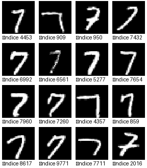
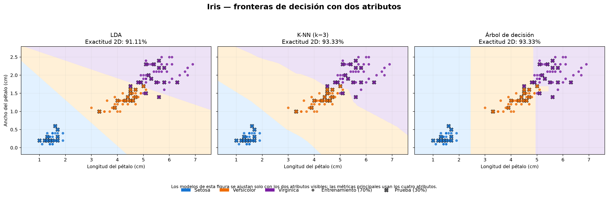
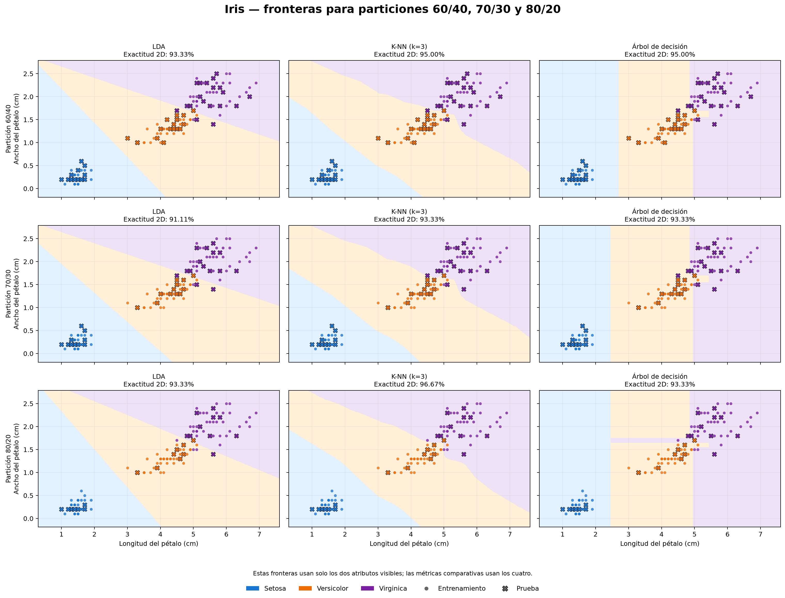

# Proyectos académicos de inteligencia artificial en Python

Este repositorio contiene cinco aplicaciones independientes de inteligencia
artificial, aprendizaje por refuerzo (Reinforcement Learning, **RL**) y
aprendizaje supervisado:

1. **GridWorld 15×15 con Value Iteration:** un agente calcula y recorre el
   camino óptimo entre un inicio y una meta, evitando cinco obstáculos.
2. **Reconocimiento de MNIST con REINFORCE:** una política aprende a seleccionar
   el número correcto para una imagen y permite reconocer archivos externos o
   consultar ejemplos de la base MNIST.
3. **GridWorld con Q-Learning:** un agente aprende por experiencia y compara su
   ruta, recompensa y costo de entrenamiento con Value Iteration.
4. **Clasificación de Iris:** compara LDA, K-NN con `k=3` y árbol de decisión
   usando una partición estratificada 70/30, fronteras de decisión y métricas.
5. **Comparación de particiones Iris:** repite los tres clasificadores con
   divisiones 60/40, 70/30 y 80/20 para estudiar el efecto del tamaño muestral.

Cada ejercicio tiene su propio archivo ejecutable, paquete, documentación,
pruebas y resultados. De esta manera se puede estudiar o ejecutar uno sin
mezclar su lógica con la de los demás.

## Contenido

- [Inicio rápido](#inicio-rápido)
- [Instalación desde cero](#instalación-desde-cero)
- [Conceptos fundamentales de RL](#conceptos-fundamentales-de-rl)
- [Aplicación 1: GridWorld](#aplicación-1-gridworld-con-value-iteration)
- [Aplicación 2: MNIST](#aplicación-2-reconocimiento-mnist-con-reinforce)
- [Aplicación 3: Q-Learning](#aplicación-3-q-learning-y-comparación)
- [Aplicación 4: clasificación de Iris](#aplicación-4-clasificación-de-iris)
- [Aplicación 5: comparación de particiones](#aplicación-5-comparación-de-particiones-iris)
- [Pruebas y validación](#pruebas-y-validación)
- [Solución de problemas](#solución-de-problemas)
- [Cómo presentar el trabajo](#cómo-presentar-el-trabajo)

## Estado actual verificado

| Componente | Resultado comprobado |
|---|---:|
| Python | 3.12.13, 64 bits |
| Pruebas automáticas | 35/35 correctas |
| GridWorld | Convergencia en 29 iteraciones |
| Camino de GridWorld | 28 pasos, recompensa acumulada 73 |
| MNIST entrenamiento | 60 000 imágenes |
| MNIST prueba | 10 000 imágenes |
| Exactitud MNIST | 92,58 % |
| Q-Learning | Ruta óptima en 5 000 episodios |
| Comparación | 28 pasos y recompensa 73 con ambos métodos |
| Iris | 105 muestras de entrenamiento y 45 de prueba |
| Mejor F1 macro en Iris | LDA: 97,78 % |
| Comparación Iris | 9 combinaciones entre partición y clasificador |
| Dependencias | Sin conflictos según `pip check` |

## Inicio rápido

Clone el repositorio y entre en su carpeta:

```powershell
git clone https://github.com/juanploxz/IA-trabajo-en-clase.git
cd IA-trabajo-en-clase
```

Después cree el entorno e instale las dependencias siguiendo la sección
[Instalación desde cero](#instalación-desde-cero). Los datos y modelos de MNIST
no se versionan por su tamaño; se preparan con los comandos documentados.

### Abrir MNIST y cargar una imagen

```powershell
.\.venv\Scripts\python.exe mnist_rl.py gui
```

### Abrir la animación de GridWorld

```powershell
.\.venv\Scripts\python.exe main.py --show-iterations --speed 0.15
```

### Entrenar Q-Learning y comparar

```powershell
.\.venv\Scripts\python.exe q_learning_grid.py --no-gui
```

### Clasificar Iris y mostrar las fronteras

```powershell
.\.venv\Scripts\python.exe iris_classification.py
```

Use `--no-gui` si solo desea guardar las gráficas y archivos CSV.

### Comparar Iris con 60/40, 70/30 y 80/20

```powershell
.\.venv\Scripts\python.exe iris_split_comparison.py
```

## Estructura del proyecto

```text
.
├── main.py                         # Entrada de GridWorld
├── mnist_rl.py                     # Aplicación independiente MNIST + RL
├── q_learning_grid.py              # Q-Learning y comparación experimental
├── iris_classification.py          # Clasificación Iris 70/30
├── iris_split_comparison.py        # Comparación Iris 60/40, 70/30 y 80/20
├── MNIST_RL_README.md              # Referencia resumida de MNIST
├── Q_LEARNING_README.md            # Documentación completa de Q-Learning
├── IRIS_CLASSIFICATION_README.md    # Documentación completa de Iris
├── IRIS_SPLIT_COMPARISON_README.md  # Análisis de las tres particiones
├── gridworld/
│   ├── __init__.py
│   ├── config.py                   # Parámetros y obstáculos
│   ├── environment.py              # Estados, acciones y transiciones
│   ├── q_learning.py               # Agente tabular y entrenamiento TD
│   ├── q_learning_comparison.py    # Curvas y tabla comparativa
│   ├── value_iteration.py          # Bellman, política y camino
│   └── visualization.py            # Cuadrícula y animaciones
├── iris_classifier/
│   ├── __init__.py
│   ├── experiment.py               # Datos, modelos, métricas y CSV
│   ├── visualization.py            # Fronteras y matrices de confusión
│   ├── split_comparison.py          # Ejecución y CSV de las tres divisiones
│   └── split_visualization.py       # Gráficas comparativas y 9 fronteras
├── data/mnist/                     # IDX y cachés NPY de MNIST
├── models/
│   └── politica_mnist_rl.npz       # Política RL entrenada
├── tests/
│   ├── test_environment.py
│   ├── test_q_learning.py
│   ├── test_value_iteration.py
│   ├── test_mnist_rl.py
│   ├── test_iris_classifier.py
│   └── test_iris_split_comparison.py
├── output/
│   ├── resultado_final.png         # Resultado de GridWorld
│   ├── mnist_consulta_7.png        # Ejemplo de consulta MNIST
│   ├── comparacion_q_learning.png  # Panel comparativo
│   ├── comparacion_q_learning.csv  # Métricas reproducibles
│   ├── iris_fronteras_decision.png # Fronteras LDA, K-NN y árbol
│   ├── iris_metricas.png           # Métricas y matrices de confusión
│   ├── iris_metricas.csv           # Resumen numérico
│   ├── iris_predicciones.csv       # Predicciones de las 45 pruebas
│   ├── iris_particiones_metricas.png
│   ├── iris_particiones_fronteras.png
│   ├── iris_particiones_metricas.csv
│   └── iris_particiones_predicciones.csv
├── requirements.txt
├── run.bat                         # Inicio automático de GridWorld en Windows
└── run.sh                          # Inicio automático de GridWorld en Unix
```

Los archivos grandes de datos, modelos, cachés y resultados generados están
excluidos mediante `.gitignore`.

## Instalación desde cero

### Requisitos

- Python 3.10 o superior.
- Conexión a internet únicamente para la primera descarga de dependencias y de
  MNIST.
- Tkinter para la ventana de MNIST. Está incluido en la instalación usada en
  este equipo.

Dependencias directas:

- `matplotlib`: visualización de GridWorld.
- `numpy`: cálculos numéricos, entrenamiento y almacenamiento de MNIST.
- `Pillow`: lectura, preparación y visualización de imágenes.
- `scikit-learn`: conjunto Iris, división estratificada, clasificadores y
  métricas de aprendizaje supervisado.

### Windows

```powershell
py -3 -m venv .venv
.\.venv\Scripts\python.exe -m pip install -r requirements.txt
```

Si `py -3` no encuentra Python, pruebe con `python` o con la ruta completa de un
Python 3.10+. Después de crear `.venv`, use siempre su ejecutable directamente;
no es necesario activar el entorno.

`run.bat` localiza primero `.venv`. Si no existe, intenta `py -3`, `python` y
`python3`, crea el entorno, instala dependencias y ejecuta **GridWorld**.

### Linux o macOS

```sh
python3 -m venv .venv
./.venv/bin/python -m pip install -r requirements.txt
chmod +x run.sh
```

En los ejemplos siguientes, sustituya `.\.venv\Scripts\python.exe` por
`./.venv/bin/python` cuando use Linux o macOS.

## Conceptos fundamentales de RL

Un problema de aprendizaje por refuerzo contiene normalmente:

- **Agente:** entidad que toma decisiones.
- **Entorno:** sistema con el que interactúa.
- **Estado `s`:** información que describe la situación actual.
- **Acción `a`:** decisión disponible para el agente.
- **Recompensa `R`:** señal numérica que indica el resultado de una acción.
- **Política `π(a|s)`:** regla o distribución usada para escoger acciones.
- **Retorno:** suma de recompensas actuales y futuras.

Las aplicaciones utilizan estos elementos de formas diferentes. Value
Iteration planifica con un MDP conocido; Q-Learning aprende el mismo GridWorld
mediante transiciones observadas; MNIST se formula como un bandido contextual.

---

# Aplicación 1: GridWorld con Value Iteration

## Objetivo

Un agente comienza en `S = (14, 0)` y debe llegar a `G = (0, 14)` dentro de una
cuadrícula 15×15. No puede salir del tablero ni atravesar obstáculos. El
algoritmo calcula el valor de cada estado, extrae una dirección óptima y anima
el recorrido.

## Formulación como MDP

| Elemento | Definición |
|---|---|
| Estado | Coordenada `(fila, columna)` transitable |
| Acciones | Arriba, derecha, abajo e izquierda |
| Transición | Determinista |
| Estado terminal | Meta `(0, 14)` |
| Movimiento normal | Recompensa `-1` |
| Movimiento inválido | Permanece en la casilla y recibe `-5` |
| Entrada a la meta | Recompensa `+100` |

La política se muestra mediante `↑`, `→`, `↓` y `←`.

## Configuración predeterminada

| Parámetro | Valor |
|---|---:|
| Filas y columnas | 15 × 15 |
| Inicio | `(14, 0)` |
| Meta | `(0, 14)` |
| Obstáculos | Exactamente 5 |
| Gamma | `0.95` |
| Tolerancia | `1e-6` |
| Máximo de iteraciones | `1000` |

Los obstáculos se definen en `gridworld/config.py`, dentro de
`OBSTACULOS_PREDETERMINADOS`. La configuración valida dimensiones, posiciones,
cantidad de obstáculos, descuento y criterios de convergencia. También puede
generar obstáculos aleatorios reproducibles y descartar escenarios sin camino.

## Algoritmo Value Iteration

Value Iteration necesita conocer el modelo de transiciones y recompensas. Para
cada estado no terminal aplica la ecuación de optimalidad de Bellman:

```text
V(s) = max_a [R(s, a, s') + γ V(s')]
```

En cada iteración:

1. Se copia el vector de valores anterior.
2. Se calcula el retorno de las cuatro acciones desde cada estado.
3. Se conserva el retorno máximo.
4. Se mide `delta`, el mayor cambio absoluto.
5. El proceso termina cuando `delta < 1e-6` o alcanza el límite.
6. La política final escoge la acción que maximiza el retorno de Bellman.
7. Se sigue la política desde el inicio, con detección de ciclos y un límite de
   seguridad.

La actualización es sincrónica: todos los valores nuevos dependen de la copia
de la iteración anterior.

## Ejecutar GridWorld

Ejecución gráfica normal:

```powershell
.\.venv\Scripts\python.exe main.py
```

Mostrar primero la propagación de valores y después el movimiento:

```powershell
.\.venv\Scripts\python.exe main.py --show-iterations --speed 0.15
```

Modo sin ventana para servidores o pruebas:

```powershell
.\.venv\Scripts\python.exe main.py --no-gui
```

Escenario aleatorio reproducible:

```powershell
.\.venv\Scripts\python.exe main.py --random-obstacles --seed 2026
```

### Argumentos de GridWorld

| Argumento | Descripción |
|---|---|
| `--seed N` | Semilla aleatoria; predeterminado `42`. |
| `--speed S` | Segundos entre cuadros; predeterminado `0.15`. |
| `--no-gui` | No abre una ventana y guarda el resultado con Agg. |
| `--show-iterations` | Anima valores y política provisional. |
| `--random-obstacles` | Genera cinco obstáculos resolubles. |
| `--max-iterations N` | Cambia el límite de actualizaciones. |

Ayuda incorporada:

```powershell
.\.venv\Scripts\python.exe main.py --help
```

## Visualización de GridWorld

- Verde: inicio `S`.
- Rojo: meta `G`.
- Negro: obstáculos.
- Crema: estados transitables.
- Azul: camino óptimo.
- Naranja: agente.

Las casillas muestran el valor redondeado y la flecha de política. El título
muestra la iteración y `delta` durante la convergencia, o el paso actual durante
el recorrido. El resultado se guarda siempre en:

```text
output/resultado_final.png
```

## Resultado verificado de GridWorld

```text
Convergió: Sí
Iteraciones: 29
Camino: (14, 0) → ... → (0, 14)
Cantidad de pasos: 28
Recompensa acumulada: 73.00
```


---

# Aplicación 2: reconocimiento MNIST con REINFORCE

## Nota académica importante

MNIST es un problema de clasificación y normalmente se resuelve de manera más
eficiente mediante aprendizaje supervisado. Aquí se usa RL intencionalmente para
demostrar cómo una decisión de clasificación puede formularse como un **bandido
contextual**. No se está afirmando que REINFORCE sea el método más eficiente
para MNIST.

## Formulación del problema

| Elemento de RL | Implementación en MNIST |
|---|---|
| Estado o contexto | 784 píxeles normalizados de una imagen 28×28 |
| Acciones | Escoger un dígito entre 0 y 9 |
| Política | Distribución softmax `π(a|s)` |
| Exploración | Se muestrea una acción según la política |
| Recompensa correcta | `+1` |
| Recompensa incorrecta | `-1` |
| Objetivo | Maximizar la recompensa media y la tasa de aciertos |

La etiqueta no se entrega como una respuesta directa al gradiente. Primero se
muestrea una acción y la etiqueta se utiliza únicamente para producir la
recompensa.

## Actualización REINFORCE

La política se actualiza mediante:

```text
θ ← θ + α (R - b) ∇θ log πθ(a|s)
```

Donde:

- `θ` representa pesos y sesgos.
- `α` es la tasa de aprendizaje.
- `R` es `+1` o `-1`.
- `b` es una línea base móvil que reduce la varianza.
- `R - b` es la ventaja de la acción seleccionada.

Detalles implementados:

- Política lineal de `784 × 10` parámetros más sesgo.
- Softmax estable para obtener probabilidades.
- Muestreo de acciones durante el entrenamiento.
- Línea base móvil exponencial.
- Regularización de entropía para conservar exploración.
- Regularización L2 y recorte de norma de gradiente.
- Optimizador Adam.
- Evaluación por bloques para controlar el uso de memoria.

## Base de datos y acceso rápido

El comando `preparar` descarga los cuatro archivos IDX de MNIST desde el espejo
público usado por TensorFlow, verifica sus sumas MD5 y crea cachés `.npy`.

```powershell
.\.venv\Scripts\python.exe mnist_rl.py preparar
```

Las cachés se abren con memoria mapeada. Esto permite buscar por etiqueta sin
cargar los 60 000 ejemplos completos en la memoria RAM. Si los archivos ya
existen, el comando no vuelve a descargarlos.

Archivos principales:

```text
data/mnist/imagenes_entrenamiento.npy
data/mnist/etiquetas_entrenamiento.npy
data/mnist/imagenes_prueba.npy
data/mnist/etiquetas_prueba.npy
```

## Entrenar la política

Entrenamiento completo predeterminado:

```powershell
.\.venv\Scripts\python.exe mnist_rl.py entrenar --epochs 10
```

Demostración rápida con menos imágenes:

```powershell
.\.venv\Scripts\python.exe mnist_rl.py entrenar --epochs 3 --limit 10000
```

Continuar desde el modelo existente:

```powershell
.\.venv\Scripts\python.exe mnist_rl.py entrenar --epochs 3 --continuar
```

Opciones de entrenamiento:

| Opción | Descripción | Valor inicial |
|---|---|---:|
| `--epochs N` | Cantidad de recorridos sobre los datos | `10` |
| `--batch-size N` | Contextos procesados por lote | `512` |
| `--learning-rate X` | Tasa de Adam | `0.01` |
| `--seed N` | Reproducibilidad de pesos, orden y acciones | `42` |
| `--limit N` | Máximo de imágenes por época | Sin límite |
| `--continuar` | Carga el modelo guardado antes de entrenar | Desactivado |

El modelo se guarda en:

```text
models/politica_mnist_rl.npz
```

La ejecución verificada alcanzó `92,58 %` en las 10 000 imágenes de prueba.
Esta métrica usa `argmax` de la política. Los porcentajes mostrados para una
imagen son puntuaciones softmax de la política y no deben interpretarse como
probabilidades perfectamente calibradas.

## Interfaz gráfica MNIST

Ejecute:

```powershell
.\.venv\Scripts\python.exe mnist_rl.py gui
```

La ventana ofrece dos flujos:

1. **Cargar imagen y reconocer:** abre un selector de archivos, prepara la
   imagen y muestra la acción elegida y las tres puntuaciones más altas.
2. **Buscar en MNIST:** escriba un número de 0 a 9 y recupere 16 ejemplos del
   conjunto de prueba con sus índices.

El procesamiento y la inferencia se realizan localmente. Las imágenes cargadas
no se envían a una API ni a un servidor.

## Qué imagen se puede cargar

La imagen debe contener un solo dígito entre 0 y 9.

Recomendaciones:

- Número grande, centrado y de trazo grueso.
- Fondo blanco y trazo negro, o fondo negro y trazo blanco.
- Sin palabras, bordes decorativos, sombras ni otros objetos.
- Formato PNG, JPG, JPEG, BMP o GIF.
- No necesita tener 28×28; puede ser mayor.

El programa realiza automáticamente:

1. Conversión a escala de grises.
2. Detección del color de fondo e inversión cuando corresponde.
3. Detección y recorte del trazo.
4. Escalado proporcional a un área máxima de 20×20.
5. Inserción en un lienzo negro de 28×28.
6. Centrado por centro de masa.
7. Normalización de píxeles para la política.

Hay una imagen preparada para probar la GUI:

```text
work/subida_numero_7.png
```

## Reconocer imágenes desde la terminal

```powershell
.\.venv\Scripts\python.exe mnist_rl.py predecir "C:\ruta\numero.png"
```

También puede pasar varias rutas en el mismo comando:

```powershell
.\.venv\Scripts\python.exe mnist_rl.py predecir uno.png dos.png tres.png
```

Ejemplo de salida real:

```text
work\subida_numero_7.png: predicción 7 | política: 7=100.00%, ...
```

## Consultar la base por número

Buscar 16 ejemplos del número 7:

```powershell
.\.venv\Scripts\python.exe mnist_rl.py consultar 7 --count 16
```

Buscar en el conjunto de entrenamiento y utilizar otra semilla:

```powershell
.\.venv\Scripts\python.exe mnist_rl.py consultar 3 --count 20 --split train --seed 2026
```

Guardar en una ruta elegida:

```powershell
.\.venv\Scripts\python.exe mnist_rl.py consultar 5 --output output\cincos.png
```

Si no se proporciona `--output`, se crea
`output/mnist_consulta_<dígito>.png`.



## Rutas alternativas de datos y modelo

`--data-dir` y `--model` son opciones globales y deben aparecer antes del
subcomando:

```powershell
.\.venv\Scripts\python.exe mnist_rl.py `
  --data-dir otra_carpeta `
  --model models\otro_modelo.npz `
  entrenar --epochs 5
```

Ayuda general:

```powershell
.\.venv\Scripts\python.exe mnist_rl.py --help
```

## Interpretación del registro de entrenamiento

Una línea como:

```text
Época 10/10 | recompensa=+0.8287 | acciones correctas=91.44% |
exactitud test=92.58% | 0.35 s
```

significa:

- **Recompensa:** promedio de `+1` y `-1` obtenido por acciones muestreadas.
- **Acciones correctas:** porcentaje acertado durante exploración.
- **Exactitud test:** porcentaje obtenido eligiendo la acción más probable en
  datos no usados para actualizar los pesos.
- **Tiempo:** duración de esa época en el equipo actual.

---

# Aplicación 3: Q-Learning y comparación

`q_learning_grid.py` utiliza exactamente el mismo tablero, cinco obstáculos,
recompensas, inicio, meta y `gamma` del ejercicio de Value Iteration. Esto
permite comparar los algoritmos sin cambiar el problema.

La documentación ampliada está en `Q_LEARNING_README.md`.

## Diferencia fundamental

- **Value Iteration** conoce el modelo completo y calcula valores mediante
  barridos de Bellman.
- **Q-Learning** desconoce el modelo completo y actualiza una tabla usando cada
  transición observada durante episodios.

Q-Learning es un método TD off-policy. Su actualización es:

```text
Q(s,a) ← Q(s,a) + α [r + γ max_a' Q(s',a') - Q(s,a)]
```

El agente usa una conducta epsilon-greedy: explora aleatoriamente con
probabilidad `epsilon` y, en caso contrario, escoge una de las mejores acciones
conocidas. Epsilon desciende de `1.0` a `0.02`.

## Parámetros predeterminados

| Parámetro | Valor |
|---|---:|
| Episodios | 5 000 |
| Alpha | 0.20 |
| Gamma | 0.95 |
| Epsilon inicial | 1.00 |
| Epsilon mínimo | 0.02 |
| Decaimiento | 0.997 |
| Máximo de pasos | 500 |
| Semilla | 42 |

## Ejecutar la comparación

Guardar resultados sin abrir ventana:

```powershell
.\.venv\Scripts\python.exe q_learning_grid.py --no-gui
```

Entrenar y mostrar la figura:

```powershell
.\.venv\Scripts\python.exe q_learning_grid.py
```

Ejemplo con parámetros diferentes:

```powershell
.\.venv\Scripts\python.exe q_learning_grid.py `
  --episodes 8000 `
  --alpha 0.15 `
  --epsilon-decay 0.998 `
  --seed 2026 `
  --no-gui
```

### Argumentos de Q-Learning

| Argumento | Descripción |
|---|---|
| `--episodes N` | Episodios de entrenamiento. |
| `--alpha X` | Tasa de aprendizaje. |
| `--gamma X` | Factor de descuento. |
| `--epsilon-start X` | Exploración inicial. |
| `--epsilon-min X` | Exploración mínima. |
| `--epsilon-decay X` | Decaimiento por episodio. |
| `--max-steps N` | Límite de pasos por episodio. |
| `--seed N` | Semilla reproducible. |
| `--report-every N` | Intervalo del reporte en terminal. |
| `--random-obstacles` | Genera otro escenario resoluble. |
| `--no-gui` | Guarda sin abrir ventana. |
| `--output RUTA` | Ruta de la gráfica. |
| `--csv RUTA` | Ruta de las métricas. |
| `--model RUTA` | Ruta de la tabla Q. |

## Resultado experimental

| Métrica | Value Iteration | Q-Learning |
|---|---:|---:|
| Requiere modelo | Sí | No |
| Barridos o episodios | 29 | 5 000 |
| Interacciones reales | 0 | 186 264 |
| Tiempo observado | 0,08–0,09 s | 4,46–9,74 s |
| Pasos del camino final | 28 | 28 |
| Recompensa del camino | 73 | 73 |
| Éxito en últimos 100 | 100 % | 100 % |
| Primera ventana con 95 % | No aplica | Episodio 139 |

Los tiempos varían según el computador. Los dos métodos pueden seleccionar
caminos diferentes porque existen varias rutas óptimas; la igualdad relevante
es tener 28 pasos y recompensa 73.

Value Iteration fue más rápido porque el entorno es pequeño, determinista y
conocido. Q-Learning resulta útil cuando el modelo es desconocido y solo es
posible aprender interactuando, aunque requiere más muestras y ajuste de
hiperparámetros.

## Resultados generados

```text
models/q_learning_grid.npz
output/comparacion_q_learning.png
output/comparacion_q_learning.csv
```

La figura contiene la política Q, el camino, la recompensa media, los pasos, la
tasa de éxito y una tabla comparativa.


# Aplicación 4: clasificación de Iris

Este ejercicio es independiente de los tres ejercicios de RL. Su entrada es
`iris_classification.py`, su implementación está en `iris_classifier/` y su
guía detallada está en `IRIS_CLASSIFICATION_README.md`.

## Objetivo y partición

Se cargan las 150 observaciones de Iris, con cuatro atributos y tres clases:
Setosa, Versicolor y Virginica. La división se realiza una sola vez y se
comparte entre todos los clasificadores:

- 70 % para entrenamiento: 105 flores, 35 de cada especie.
- 30 % para prueba: 45 flores, 15 de cada especie.
- Muestreo estratificado para conservar el balance de clases.
- Semilla `42` para que el resultado sea reproducible.

## Clasificadores

- **LDA:** encuentra combinaciones lineales que separan las clases.
- **K-NN (3):** asigna la clase mayoritaria entre los tres vecinos más
  cercanos. Incluye estandarización para que las distancias sean comparables.
- **Árbol de decisión:** aprende reglas binarias sobre los atributos; usa la
  misma semilla del experimento.

## Métricas y fronteras de decisión

Las métricas principales se calculan sobre las 45 muestras de prueba usando
los cuatro atributos: accuracy, precisión macro, recall macro, F1 macro,
reporte por clase y matriz de confusión.

Una frontera completa viviría en cuatro dimensiones y no puede representarse
fielmente en un plano. Por eso, solo para la figura de fronteras, se entrenan
copias de los tres modelos con longitud y ancho del pétalo. La propia gráfica
lo indica para evitar confundir la exactitud 2D con las métricas principales.

## Ejecutar

Mostrar las dos figuras:

```powershell
.\.venv\Scripts\python.exe iris_classification.py
```

Guardar resultados sin abrir ventanas:

```powershell
.\.venv\Scripts\python.exe iris_classification.py --no-gui
```

Consultar todas las opciones:

```powershell
.\.venv\Scripts\python.exe iris_classification.py --help
```

## Resultado reproducible verificado

| Clasificador | Accuracy | Precisión macro | Recall macro | F1 macro |
|---|---:|---:|---:|---:|
| LDA | 97,78 % | 97,92 % | 97,78 % | 97,78 % |
| K-NN (k=3) | 91,11 % | 92,98 % | 91,11 % | 90,95 % |
| Árbol de decisión | 93,33 % | 94,44 % | 93,33 % | 93,27 % |

Con la semilla predeterminada, LDA obtuvo el F1 macro más alto. Este resultado
describe esta partición específica; no demuestra que LDA sea siempre superior.

Archivos generados:

```text
output/iris_fronteras_decision.png
output/iris_metricas.png
output/iris_metricas.csv
output/iris_predicciones.csv
```




# Aplicación 5: comparación de particiones Iris

Este ejercicio tiene su propia entrada, `iris_split_comparison.py`, y su guía
completa en `IRIS_SPLIT_COMPARISON_README.md`. Reutiliza la carga y los modelos
del paquete Iris, pero produce resultados y pruebas independientes.

## Pregunta experimental

¿Qué ocurre si se cambia la división 70/30 por 60/40 u 80/20? Las tres
configuraciones se ejecutan con la misma semilla, estratificación y modelos:

| Partición | Entrenamiento | Prueba | Entrenamiento por clase | Prueba por clase |
|---|---:|---:|---:|---:|
| 60/40 | 90 | 60 | 30 | 20 |
| 70/30 | 105 | 45 | 35 | 15 |
| 80/20 | 120 | 30 | 40 | 10 |

## Ejecutar la comparación

```powershell
.\.venv\Scripts\python.exe iris_split_comparison.py
```

Para generar PNG y CSV sin abrir ventanas:

```powershell
.\.venv\Scripts\python.exe iris_split_comparison.py --no-gui
```

## Resultados obtenidos

| Partición | Clasificador | Accuracy | F1 macro |
|---|---|---:|---:|
| 60/40 | LDA | 98,33 % | 98,33 % |
| 60/40 | K-NN (k=3) | 95,00 % | 94,97 % |
| 60/40 | Árbol de decisión | 95,00 % | 95,00 % |
| 70/30 | LDA | 97,78 % | 97,78 % |
| 70/30 | K-NN (k=3) | 91,11 % | 90,95 % |
| 70/30 | Árbol de decisión | 93,33 % | 93,27 % |
| 80/20 | LDA | 100,00 % | 100,00 % |
| 80/20 | K-NN (k=3) | 93,33 % | 93,27 % |
| 80/20 | Árbol de decisión | 93,33 % | 93,33 % |

LDA obtuvo 100 % con 80/20, pero solo se evaluaron 30 flores. K-NN y el árbol
obtuvieron su mejor F1 con 60/40. Por tanto, más datos de entrenamiento no
producen necesariamente una mejora monotónica en una sola división: también
cambian las observaciones evaluadas. Cada error vale 3,33 puntos de accuracy en
80/20, frente a 1,67 puntos en 60/40.

La primera figura compara cantidad de muestras y las cuatro métricas. La segunda
muestra nueve fronteras: tres particiones por tres clasificadores.

```text
output/iris_particiones_metricas.png
output/iris_particiones_fronteras.png
output/iris_particiones_metricas.csv
output/iris_particiones_predicciones.csv
```




# Pruebas y validación

Ejecute toda la batería:

```powershell
.\.venv\Scripts\python.exe -m unittest discover -s tests -v
```

Las 35 pruebas cubren:

- Dimensiones, posiciones y cinco obstáculos de GridWorld.
- Movimientos fuera del tablero y bloqueo por obstáculos.
- Recompensa terminal y generación aleatoria reproducible.
- Convergencia y optimalidad de Bellman.
- Inicio, meta, adyacencia y seguridad del camino.
- Generación real del PNG en modo sin interfaz.
- Distribuciones softmax válidas.
- Actualización de pesos mediante REINFORCE.
- Guardado y carga del modelo sin alterar predicciones.
- Conversión y centrado de imágenes externas.
- Consulta por etiqueta y construcción de mosaicos.
- Fórmula de actualización TD de Q-Learning.
- Dimensiones, visitas y reproducibilidad de la tabla Q.
- Validez de la política aprendida.
- Equivalencia de la ruta Q con la referencia de Value Iteration.
- Partición Iris 70/30 estratificada y reproducible.
- Configuración exacta de LDA, K-NN con tres vecinos y árbol de decisión.
- Rango y coherencia de accuracy, precisión, recall y F1 macro.
- Entrenamiento de las fronteras con exactamente dos atributos.
- Generación real de PNG y CSV de Iris en modo sin interfaz.
- Tamaños y balance por clase en las particiones 60/40, 70/30 y 80/20.
- Comparación reproducible de nueve combinaciones de modelo y partición.
- Exportación de nueve filas de métricas y 135 filas de predicciones.
- Generación real de dos PNG y dos CSV del ejercicio comparativo.

Validar las dependencias instaladas:

```powershell
.\.venv\Scripts\python.exe -m pip check
```

# Reproducción completa desde cero

Después de instalar dependencias:

```powershell
# 1. Preparar MNIST
.\.venv\Scripts\python.exe mnist_rl.py preparar

# 2. Entrenar la política RL
.\.venv\Scripts\python.exe mnist_rl.py entrenar --epochs 10

# 3. Consultar un número
.\.venv\Scripts\python.exe mnist_rl.py consultar 7 --count 16

# 4. Ejecutar la interfaz
.\.venv\Scripts\python.exe mnist_rl.py gui

# 5. Ejecutar GridWorld sin ventana
.\.venv\Scripts\python.exe main.py --no-gui

# 6. Entrenar Q-Learning y comparar
.\.venv\Scripts\python.exe q_learning_grid.py --no-gui

# 7. Clasificar Iris y generar sus resultados
.\.venv\Scripts\python.exe iris_classification.py --no-gui

# 8. Comparar las tres particiones de Iris
.\.venv\Scripts\python.exe iris_split_comparison.py --no-gui

# 9. Ejecutar todas las pruebas
.\.venv\Scripts\python.exe -m unittest discover -s tests -v
```

# Solución de problemas

## PowerShell dice que no encuentra el archivo

Compruebe la carpeta actual:

```powershell
Get-Location
```

Después entre en la carpeta indicada en la sección de inicio rápido.

## No existe `.venv\Scripts\python.exe`

Cree nuevamente el entorno e instale las dependencias:

```powershell
py -3 -m venv .venv
.\.venv\Scripts\python.exe -m pip install -r requirements.txt
```

## La GUI dice que el modelo no está entrenado

```powershell
.\.venv\Scripts\python.exe mnist_rl.py entrenar --epochs 10
```

## No puede descargar MNIST

Revise la conexión y vuelva a ejecutar `mnist_rl.py preparar`. Las descargas
parciales usan la extensión `.part` y no sustituyen archivos válidos. Todos los
archivos completos se verifican por MD5.

## La imagen se reconoce incorrectamente

- Dibuje un solo número, más grande y centrado.
- Use alto contraste y un trazo parecido a escritura manual.
- Elimine ruido, texto o marcos.
- Recuerde que el modelo lineal tiene 92,58 % de exactitud, no 100 %.
- Considere entrenar más épocas o implementar una red neuronal no lineal.

## No aparece una ventana gráfica

GridWorld puede ejecutarse con `--no-gui`. Para MNIST puede usar `predecir` y
`consultar` desde terminal. En Linux, verifique que exista una sesión gráfica y
que Tkinter esté instalado para su versión de Python.

## Q-Learning no llega a la meta

Aumente `--episodes`, reduzca más lentamente `--epsilon-decay` o incremente
`--max-steps`. Con la configuración y semilla predeterminadas, la ruta fue
validada correctamente.

## Las fronteras de Iris no coinciden exactamente con las métricas

Es el comportamiento esperado. Las métricas usan los cuatro atributos de Iris;
las fronteras se ajustan solo con los dos atributos seleccionados porque una
figura plana no puede mostrar cuatro dimensiones. Puede elegir otra pareja con
`--features`, usando índices entre 0 y 3.

## Una partición con más entrenamiento obtiene una métrica menor

No necesariamente es un error. Además del tamaño de entrenamiento, cambia la
composición del conjunto de prueba. Con solo 30 flores en 80/20, cada fallo
altera el accuracy en 3,33 puntos. Use varias semillas o validación cruzada para
comparar el comportamiento promedio y no depender de una sola división.

# Cómo presentar el trabajo

## GridWorld

1. Defina estados, acciones, recompensas y estado terminal.
2. Muestre la ecuación de Bellman y la actualización sincrónica.
3. Explique `gamma`, tolerancia y `delta`.
4. Ejecute `--show-iterations` para mostrar la propagación de valores.
5. Relacione las flechas con la política y la línea azul con el camino óptimo.

## MNIST

1. Aclare que MNIST suele ser supervisado y justifique el bandido contextual.
2. Identifique imagen, acciones, política y recompensas.
3. Explique por qué REINFORCE usa `∇ log π(a|s)` y una línea base.
4. Muestre cómo mejoran recompensa y exactitud durante las épocas.
5. Cargue una imagen propia y consulte varios ejemplos de un número.
6. Compare el 92,58 % del modelo lineal con posibles arquitecturas no lineales.

## Q-Learning

1. Compare aprendizaje por experiencia con planificación basada en modelo.
2. Desarrolle la ecuación TD e identifique `alpha`, `gamma` y el error TD.
3. Explique exploración y explotación mediante epsilon-greedy.
4. Muestre las curvas de recompensa, pasos y tasa de éxito.
5. Compare 29 barridos con 5 000 episodios y 186 264 interacciones.
6. Destaque que ambos métodos encontraron 28 pasos y recompensa 73.

## Iris

1. Explique la diferencia entre aprendizaje supervisado y RL.
2. Muestre por qué la división es 70/30 y por qué se usa estratificación.
3. Compare el supuesto lineal de LDA, la vecindad de K-NN y las reglas del árbol.
4. Defina accuracy, precisión, recall, F1 y matriz de confusión.
5. Aclare que las fronteras usan dos atributos y las métricas usan los cuatro.
6. Concluya que LDA ganó en esta partición por F1 macro, sin generalizar el
   resultado a todas las posibles divisiones.

## Comparación de particiones Iris

1. Compare 90/60, 105/45 y 120/30 muestras para entrenar/probar.
2. Explique el compromiso entre más aprendizaje y una evaluación más grande.
3. Muestre que LDA fue perfecto en 80/20, pero sobre solo 30 observaciones.
4. Señale que K-NN y el árbol rindieron mejor con 60/40 en esta semilla.
5. Relacione cada cambio de frontera con las muestras marcadas como prueba.
6. Concluya proponiendo validación cruzada para una comparación más sólida.

# Limitaciones y mejoras futuras

## GridWorld

- Añadir transiciones estocásticas.
- Comparar Value Iteration, Policy Iteration, Q-Learning y SARSA.
- Permitir edición interactiva del tablero.
- Exportar valores y deltas a CSV.

## MNIST

- Incorporar una política con capa oculta o convoluciones.
- Añadir aumento de datos para imágenes externas.
- Calibrar las puntuaciones softmax.
- Mostrar curvas de recompensa y exactitud.
- Guardar metadatos de cada entrenamiento.
- Comparar REINFORCE con una línea base supervisada.

## Q-Learning

- Comparar múltiples semillas con media y desviación estándar.
- Implementar SARSA y Expected SARSA.
- Añadir escenarios estocásticos.
- Permitir reanudar una tabla Q guardada.
- Comparar el método tabular con una Deep Q-Network.

## Iris

- Repetir el experimento con validación cruzada estratificada.
- Comparar medias y desviaciones para varias semillas.
- Ajustar hiperparámetros sin utilizar el conjunto de prueba.
- Añadir curvas ROC multiclase y análisis de importancia de atributos.

## Comparación de particiones Iris

- Repetir cada partición con varias semillas y mostrar media y desviación.
- Añadir validación cruzada estratificada de 5 o 10 pliegues.
- Medir intervalos de confianza de accuracy y F1.
- Separar un conjunto final que no participe en la elección de la partición.

# Resumen de comandos frecuentes

```powershell
# GUI de MNIST
.\.venv\Scripts\python.exe mnist_rl.py gui

# Reconocer una imagen
.\.venv\Scripts\python.exe mnist_rl.py predecir "C:\ruta\imagen.png"

# Consultar un número
.\.venv\Scripts\python.exe mnist_rl.py consultar 7 --count 16

# Entrenar MNIST
.\.venv\Scripts\python.exe mnist_rl.py entrenar --epochs 10

# Animar GridWorld
.\.venv\Scripts\python.exe main.py --show-iterations --speed 0.15

# Entrenar Q-Learning y comparar
.\.venv\Scripts\python.exe q_learning_grid.py --no-gui

# Clasificar Iris, mostrar fronteras y métricas
.\.venv\Scripts\python.exe iris_classification.py

# Comparar particiones 60/40, 70/30 y 80/20
.\.venv\Scripts\python.exe iris_split_comparison.py

# Ejecutar pruebas
.\.venv\Scripts\python.exe -m unittest discover -s tests -v
```
