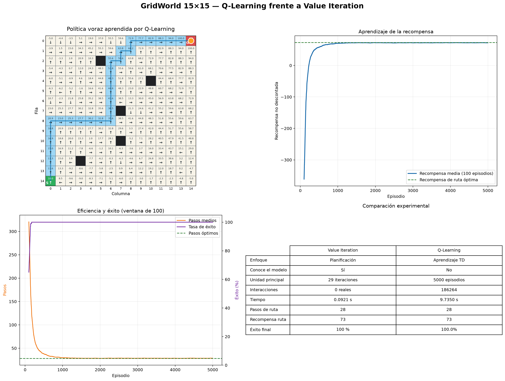

# Q-Learning en GridWorld 15×15

Este ejercicio reutiliza exactamente el entorno, obstáculos, recompensas,
inicio y meta del proyecto anterior. Implementa Q-Learning tabular y compara el
resultado aprendido con la solución exacta de Value Iteration.

## Objetivo

El agente comienza en `(14, 0)` y debe alcanzar `(0, 14)` sin atravesar cinco
obstáculos. A diferencia de Value Iteration, no recorre anticipadamente todas
las transiciones del modelo: aprende mediante episodios y experiencias
`(estado, acción, recompensa, siguiente estado)`.

## Ecuación de Q-Learning

```text
Q(s,a) ← Q(s,a) + α [r + γ max_a' Q(s',a') - Q(s,a)]
```

- `Q(s,a)`: utilidad estimada de ejecutar `a` en `s`.
- `α`: tasa de aprendizaje.
- `r`: recompensa observada.
- `γ`: factor de descuento.
- `max Q(s',a')`: mejor valor estimado desde el siguiente estado.
- El término entre corchetes es el error de diferencia temporal o error TD.

En una transición terminal, el objetivo es únicamente la recompensa porque no
existen recompensas futuras después de la meta.

## Exploración epsilon-greedy

Durante el entrenamiento:

- Con probabilidad `epsilon`, el agente prueba una acción aleatoria.
- En caso contrario, escoge una acción con el mayor valor Q conocido.
- Los empates se resuelven aleatoriamente durante el aprendizaje.
- `epsilon` disminuye gradualmente desde `1.0` hasta `0.02`.

Esto permite explorar al principio y aprovechar la política aprendida al final.
La política de evaluación siempre es voraz y resuelve empates usando el orden
estable de las acciones.

## Hiperparámetros predeterminados

| Parámetro | Valor |
|---|---:|
| Episodios | 5 000 |
| Alpha | 0.20 |
| Gamma | 0.95 |
| Epsilon inicial | 1.00 |
| Epsilon mínimo | 0.02 |
| Decaimiento de epsilon | 0.997 |
| Máximo de pasos por episodio | 500 |
| Semilla | 42 |

## Ejecutar el ejercicio

En PowerShell, desde la raíz del proyecto:

```powershell
.\.venv\Scripts\python.exe q_learning_grid.py --no-gui
```

Para mostrar la figura al finalizar:

```powershell
.\.venv\Scripts\python.exe q_learning_grid.py
```

Ayuda completa:

```powershell
.\.venv\Scripts\python.exe q_learning_grid.py --help
```

## Argumentos

| Argumento | Función |
|---|---|
| `--episodes N` | Cantidad de episodios de entrenamiento. |
| `--alpha X` | Tasa de actualización TD. |
| `--gamma X` | Descuento de recompensas futuras. |
| `--epsilon-start X` | Exploración inicial. |
| `--epsilon-min X` | Límite inferior de exploración. |
| `--epsilon-decay X` | Decaimiento por episodio. |
| `--max-steps N` | Límite de pasos de cada episodio. |
| `--seed N` | Reproducibilidad del entrenamiento. |
| `--report-every N` | Frecuencia del registro en terminal. |
| `--random-obstacles` | Usa cinco obstáculos aleatorios resolubles. |
| `--no-gui` | Guarda la gráfica sin abrir ventana. |
| `--output RUTA` | Cambia la ruta de la figura. |
| `--csv RUTA` | Cambia la ruta de las métricas. |
| `--model RUTA` | Cambia la ruta de la tabla Q. |

Ejemplo con parámetros alternativos:

```powershell
.\.venv\Scripts\python.exe q_learning_grid.py `
  --episodes 8000 `
  --alpha 0.15 `
  --epsilon-decay 0.998 `
  --seed 2026 `
  --no-gui
```

## Archivos generados

```text
models/q_learning_grid.npz
output/comparacion_q_learning.png
output/comparacion_q_learning.csv
```

El modelo contiene la tabla Q `(15, 15, 4)`, el contador de visitas y los
hiperparámetros. El CSV usa codificación UTF-8 con BOM para abrirse correctamente
en Excel.

## Resultado real verificado

| Métrica | Value Iteration | Q-Learning |
|---|---:|---:|
| Conoce el modelo | Sí | No |
| Barridos o episodios | 29 | 5 000 |
| Interacciones reales | 0 | 186 264 |
| Tiempo observado | 0,08–0,09 s | 4,46–9,74 s |
| Pasos de la ruta final | 28 | 28 |
| Recompensa de la ruta | 73 | 73 |
| Éxito en últimos 100 episodios | 100 % | 100 % |
| Estados no terminales actualizados | 219 | 219 |
| Primera ventana con 95 % de éxito | No aplica | Episodio 139 |

Los tiempos corresponden a dos ejecuciones locales y dependen de la carga del
computador. La ruta exacta también puede cambiar
porque existen varios caminos óptimos de 28 pasos; lo importante es que mantenga
la misma longitud y recompensa.

## Interpretación de la comparación

### Por qué Value Iteration fue más rápido

El entorno es pequeño, determinista y completamente conocido. Value Iteration
puede inspeccionar las cuatro transiciones de todos los estados y propagar la
recompensa de la meta directamente. Por eso es el método más eficiente para
este caso concreto.

### Por qué Q-Learning sigue siendo importante

Q-Learning no necesita conocer previamente las probabilidades de transición ni
la función completa del entorno. Puede aprender observando resultados. Es más
apropiado cuando:

- El modelo es desconocido.
- Las transiciones solo pueden descubrirse mediante interacción.
- El entorno puede cambiar y se permite continuar aprendiendo.
- Construir un modelo exacto es más difícil que obtener experiencia.

El precio es necesitar exploración, muchas interacciones y ajustar
hiperparámetros.

## Comparación conceptual con Policy Iteration

| Aspecto | Value Iteration | Policy Iteration | Q-Learning |
|---|---|---|---|
| Tipo | Planificación | Planificación | Aprendizaje TD |
| Requiere modelo | Sí | Sí | No |
| Unidad | Barrido de valores | Evaluación y mejora | Transición observada |
| Política durante cálculo | Implícita | Explícita | Epsilon-greedy |
| Solución tabular | Exacta al converger | Exacta al converger | Aproximada |

Policy Iteration se incluye como comparación teórica; la medición experimental
de este proyecto se realiza contra Value Iteration, que es el método previamente
implementado para el mismo tablero.

## Gráfica comparativa

La figura contiene:

1. Valores máximos Q, política voraz y ruta aprendida.
2. Recompensa media móvil de 100 episodios.
3. Pasos medios y tasa de éxito móvil.
4. Tabla con las métricas de ambos métodos.



## Pruebas

Ejecutar únicamente las pruebas de Q-Learning:

```powershell
.\.venv\Scripts\python.exe -m unittest tests.test_q_learning -v
```

Ejecutar toda la batería:

```powershell
.\.venv\Scripts\python.exe -m unittest discover -s tests -v
```

Las pruebas comprueban la fórmula TD, dimensiones de la tabla, reproducibilidad,
validez del camino y equivalencia de longitud y recompensa con Value Iteration.

## Cómo explicarlo en una exposición

1. Muestre que ambos métodos resuelven el mismo MDP y usan `gamma = 0.95`.
2. Explique que Value Iteration consulta todo el modelo y Q-Learning aprende de
   muestras.
3. Desarrolle la ecuación TD e identifique el error de predicción.
4. Explique el equilibrio exploración-explotación de epsilon-greedy.
5. Muestre cómo aumentan recompensa y éxito mientras disminuyen los pasos.
6. Compare el costo de 29 barridos con 186 264 interacciones.
7. Concluya que ambos alcanzaron la misma solución, pero bajo supuestos
   diferentes.

## Posibles mejoras

- Comparar varias semillas y presentar media y desviación estándar.
- Implementar SARSA para contrastar aprendizaje on-policy y off-policy.
- Añadir decaimiento de alpha.
- Entrenar en escenarios estocásticos.
- Comparar Q-Learning tabular con Deep Q-Networks.
- Permitir guardar y reanudar el entrenamiento.
