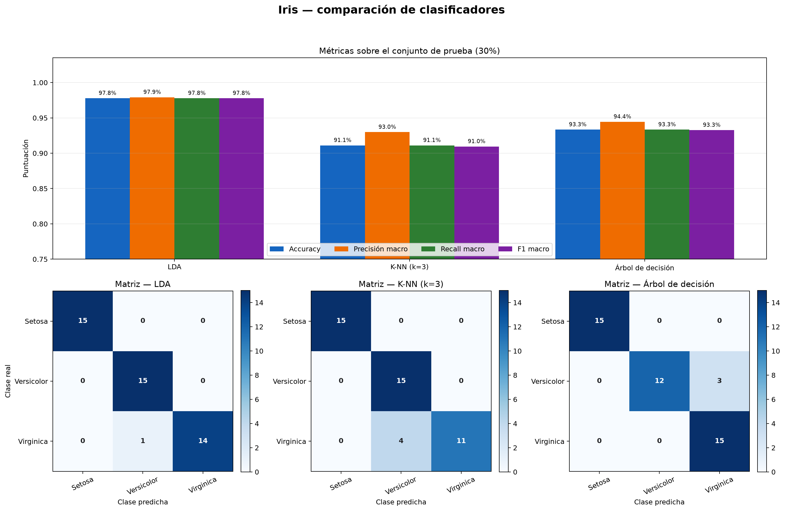
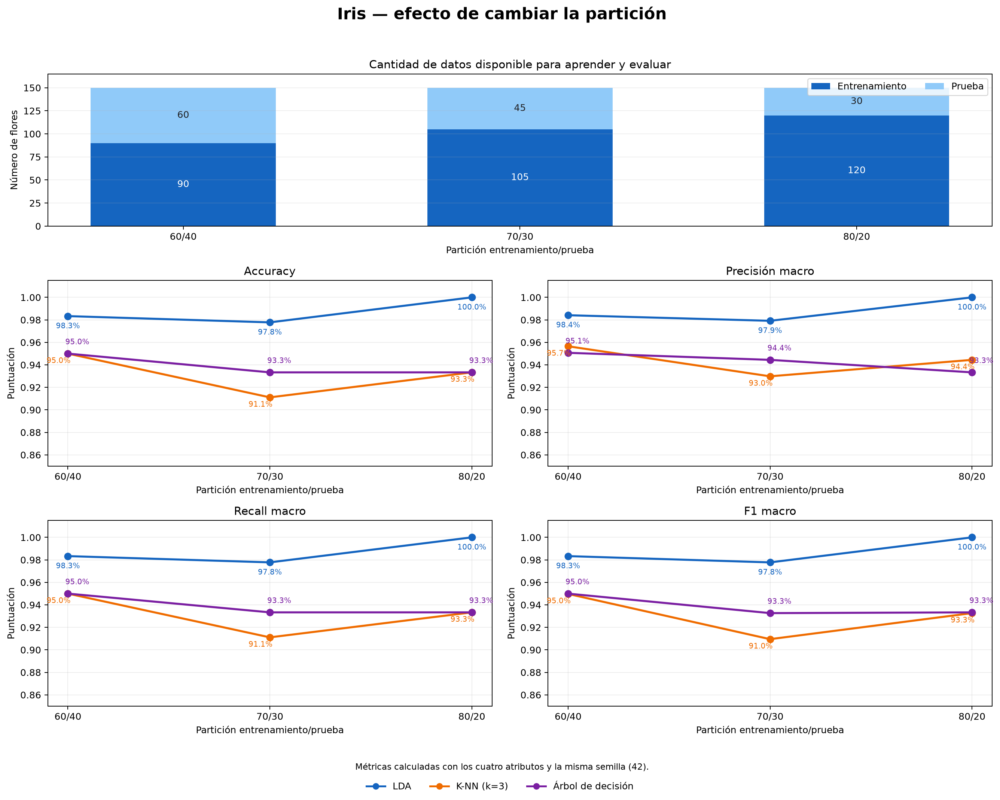
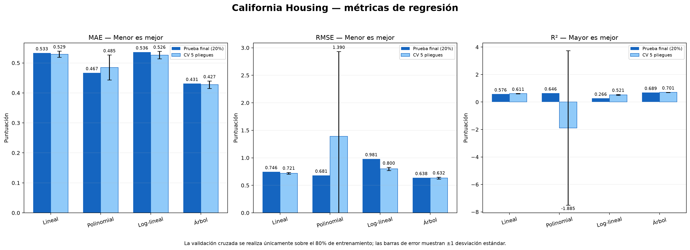
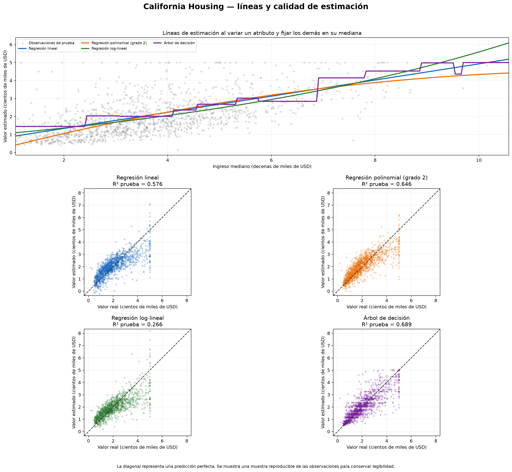
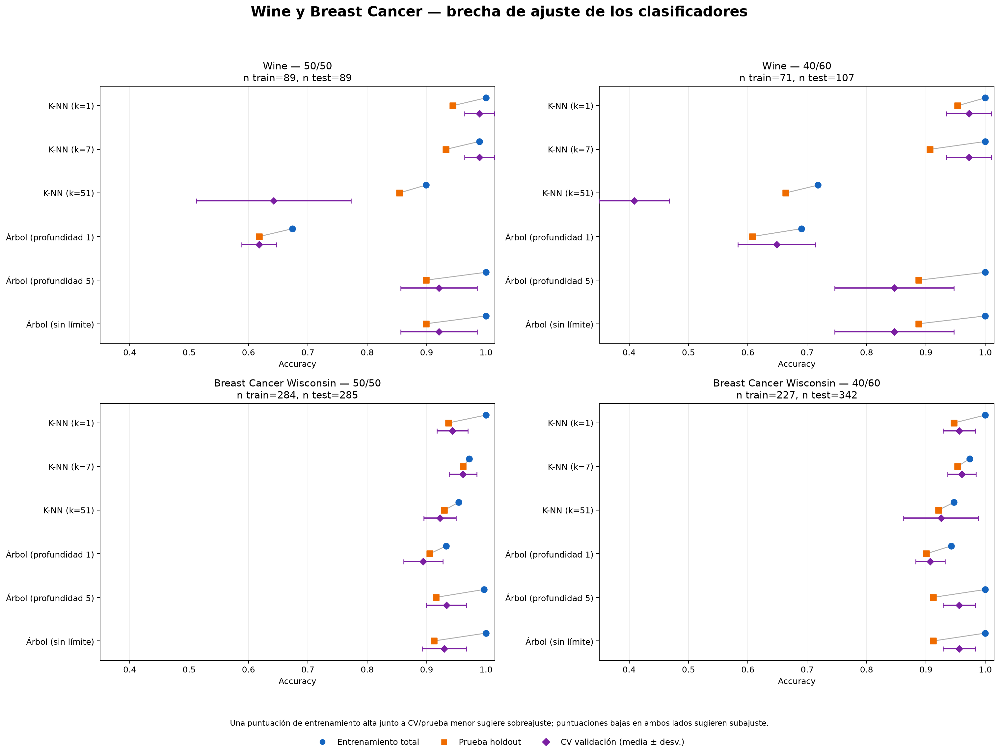
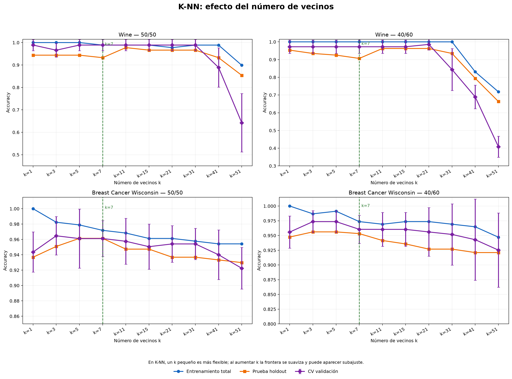
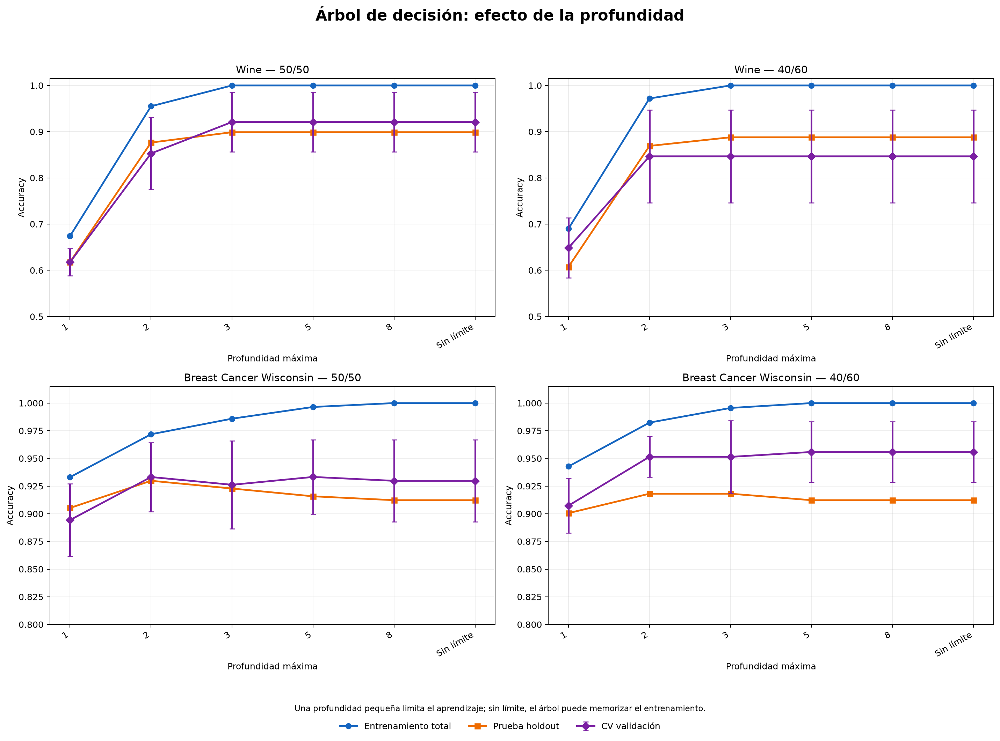
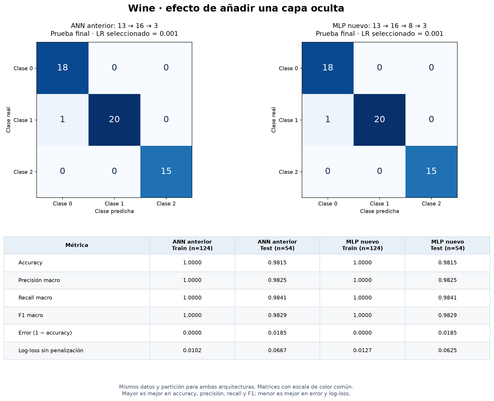
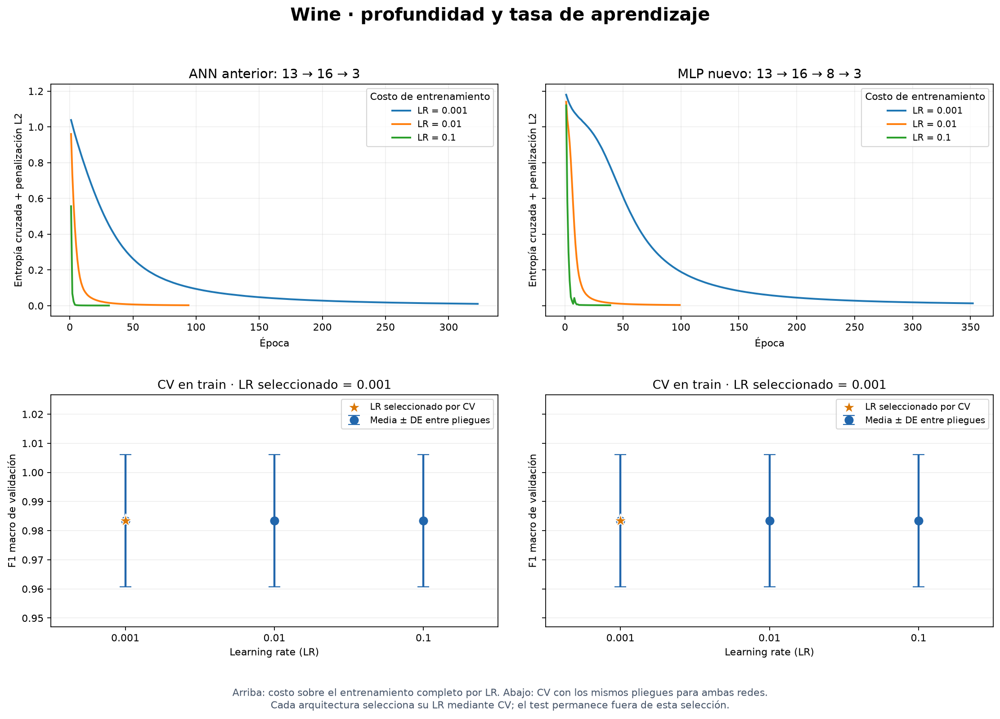
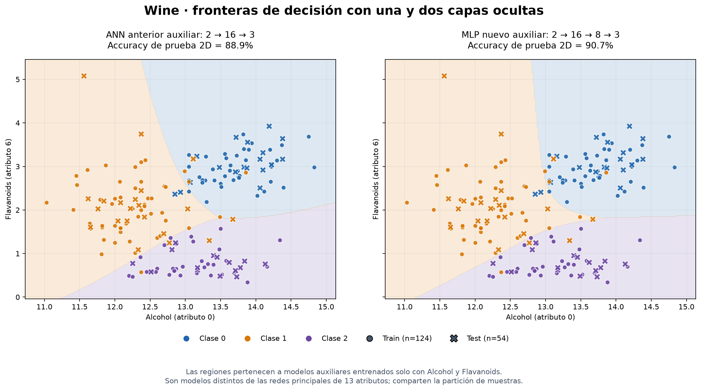

# IA: aprendizaje por refuerzo y modelos predictivos

Repositorio académico en Python con diez ejercicios independientes de
inteligencia artificial. Incluye planificación mediante MDP, aprendizaje por
refuerzo, reconocimiento de dígitos, clasificación, análisis de ajuste y
regresión supervisada, generación de datos con ruido y redes neuronales.

Cada ejercicio tiene un ejecutable propio, documentación y resultados
reproducibles. El repositorio también incluye pruebas automáticas para los
algoritmos de los ejercicios anteriores. La explicación conjunta y ampliada está en
[DOCUMENTACION_COMPLETA.md](DOCUMENTACION_COMPLETA.md).

## Ejercicios

| # | Ejercicio | Método | Ejecutable | Documentación |
|---:|---|---|---|---|
| 1 | GridWorld 15×15 | Value Iteration | `main.py` | [Guía](VALUE_ITERATION_README.md) |
| 2 | Reconocimiento de MNIST | REINFORCE como bandido contextual | `mnist_rl.py` | [Guía](MNIST_RL_README.md) |
| 3 | GridWorld 15×15 | Q-Learning y comparación | `q_learning_grid.py` | [Guía](Q_LEARNING_README.md) |
| 4 | Clasificación de Iris | LDA, K-NN(3) y árbol | `iris_classification.py` | [Guía](IRIS_CLASSIFICATION_README.md) |
| 5 | Particiones de Iris | Comparación 60/40, 70/30 y 80/20 | `iris_split_comparison.py` | [Guía](IRIS_SPLIT_COMPARISON_README.md) |
| 6 | California Housing | Regresión lineal, polinomial, log-lineal y árbol | `california_housing_regression.py` | [Guía](CALIFORNIA_HOUSING_README.md) |
| 7 | Subajuste y sobreajuste | K-NN y árboles con Wine/Breast Cancer | `classification_fit_comparison.py` | [Guía](CLASSIFICATION_FIT_README.md) |
| 8 | Puntos sobre una recta con ruido | 100 muestras aleatorias y dispersión | `recta_con_ruido.py` | [Guía](RECTA_RUIDO_README.md) |
| 9 | Wine con red neuronal | ANN sigmoide, split 70/30 y selección de learning rate con CV | `ann_wine.py` | [Guía](ANN_WINE_README.md) |
| 10 | Comparación de MLP para Wine | Una frente a dos capas ocultas y learning rate | `mlp_wine_compare.py` | [Guía](MLP_WINE_README.md) |

## Resumen de cada ejercicio

### 1. Value Iteration

Resuelve un GridWorld determinista de 15×15 con cinco obstáculos. El algoritmo
conoce el modelo del entorno, actualiza los valores con Bellman y extrae una
política óptima. Con la configuración predeterminada converge en 29 iteraciones
y encuentra una ruta de 28 pasos con recompensa acumulada 73.

### 2. MNIST con REINFORCE

Formula el reconocimiento de dígitos como un bandido contextual: la imagen es
el estado, elegir un número es la acción y la etiqueta determina la recompensa.
Permite descargar MNIST, entrenar la política, consultar ejemplos por número,
reconocer imágenes externas y utilizar una interfaz gráfica.

### 3. Q-Learning

Aprende por experiencia sobre el mismo GridWorld del primer ejercicio. La
comparación muestra la diferencia entre planificación con modelo y aprendizaje
sin modelo. Después de 5 000 episodios, Q-Learning obtiene una ruta con la misma
longitud y recompensa que Value Iteration.

### 4. Clasificación de Iris

Aplica una partición estratificada 70/30 y compara LDA, K-NN con tres vecinos y
árbol de decisión. Genera accuracy, precisión macro, recall macro, F1 macro,
matrices de confusión y fronteras de decisión bidimensionales.

### 5. Comparación de particiones Iris

Repite los tres clasificadores con divisiones 60/40, 70/30 y 80/20. El ejercicio
muestra el compromiso entre disponer de más datos para aprender y conservar un
conjunto de prueba suficientemente grande para evaluar de forma estable.

### 6. Regresión con California Housing

Compara regresión lineal, polinomial de grado 2, log-lineal y árbol de decisión.
Usa una prueba final 80/20 y validación cruzada de cinco pliegues sobre el
entrenamiento. Exporta MAE, RMSE, R², resultados por pliegue, predicciones y
líneas de estimación al variar el ingreso mediano.

### 7. Subajuste y sobreajuste

Compara K-NN y árboles deliberadamente simples, intermedios y flexibles sobre
Wine y Breast Cancer. Usa particiones estratificadas 50/50 y 40/60, más
validación cruzada de cinco pliegues dentro del entrenamiento. Contrasta
accuracy de train, prueba y CV, brechas de generalización y curvas para `k` y
profundidad.

### 8. Recta con ruido

Genera 100 coordenadas con `x` aleatorio entre 0 y 10 y `y = m*x + b + ruido`.
La configuración inicial usa `m=2`, `b=1` y ruido normal de desviación 2.
Muestra los puntos junto a la recta ideal y guarda la figura y las coordenadas.

### 9. Red neuronal para Wine

Entrena una ANN con 13 entradas, una capa oculta de 16 neuronas sigmoides y
3 neuronas de salida softmax, con conexiones completas entre capas. Reserva
30 % para prueba y compara tasas
de aprendizaje `0.001`, `0.01` y `0.1` con CV estratificada de cinco pliegues
solo sobre el 70 % de entrenamiento. Reporta resultados, curvas del costo y
una frontera auxiliar entrenada con dos atributos. Exporta los 256 pesos,
19 sesgos y el escalado para inspeccionar la red aprendida iterativamente.

### 10. Comparación de perceptrones multicapa

La ANN anterior ya es un MLP. Este ejercicio compara su arquitectura
`13 → 16 → 3` con otra de dos capas ocultas, `13 → 16 → 8 → 3`. Mantiene
los mismos datos, partición 70/30, pliegues de CV y configuración de Adam.
Selecciona una tasa por arquitectura mediante F1 de CV y muestra métricas,
costos, matrices de confusión y fronteras auxiliares de dos atributos.

## Instalación

Requiere Python 3.10 o superior.

### Windows PowerShell

```powershell
git clone https://github.com/juanploxz/IA-trabajo-en-clase.git
cd IA-trabajo-en-clase
py -3 -m venv .venv
.\.venv\Scripts\python.exe -m pip install -r requirements.txt
```

### Linux o macOS

```sh
git clone https://github.com/juanploxz/IA-trabajo-en-clase.git
cd IA-trabajo-en-clase
python3 -m venv .venv
./.venv/bin/python -m pip install -r requirements.txt
```

## Ejecución rápida

Los comandos siguientes usan PowerShell. En Linux o macOS sustituya
`.\.venv\Scripts\python.exe` por `./.venv/bin/python`.

```powershell
# Value Iteration
.\.venv\Scripts\python.exe main.py

# Preparar, entrenar y abrir MNIST
.\.venv\Scripts\python.exe mnist_rl.py preparar
.\.venv\Scripts\python.exe mnist_rl.py entrenar --epochs 10
.\.venv\Scripts\python.exe mnist_rl.py gui

# Probar el reconocimiento con la imagen incluida
.\.venv\Scripts\python.exe mnist_rl.py predecir examples\numero_7.png

# Q-Learning y comparación
.\.venv\Scripts\python.exe q_learning_grid.py --no-gui

# Clasificación Iris 70/30
.\.venv\Scripts\python.exe iris_classification.py

# Comparación Iris 60/40, 70/30 y 80/20
.\.venv\Scripts\python.exe iris_split_comparison.py

# Regresión California Housing con validación cruzada
.\.venv\Scripts\python.exe california_housing_regression.py --no-gui

# Subajuste y sobreajuste con Wine y Breast Cancer
.\.venv\Scripts\python.exe classification_fit_comparison.py --no-gui

# Generar y dibujar 100 puntos sobre una recta con ruido
.\.venv\Scripts\python.exe recta_con_ruido.py

# ANN sigmoide para Wine, validación cruzada y learning rate
.\.venv\Scripts\python.exe ann_wine.py --no-gui

# Comparar MLP de una y dos capas ocultas
.\.venv\Scripts\python.exe mlp_wine_compare.py --no-gui
```

Los comandos que aceptan `--no-gui` guardan resultados sin abrir ventanas.
Use `--help` en cada ejecutable para consultar sus opciones.

## Resultados destacados

| Experimento | Resultado verificado |
|---|---:|
| Pruebas automáticas | 62/62 correctas |
| Value Iteration | 28 pasos; recompensa 73 |
| MNIST REINFORCE | 92,58 % de exactitud |
| Q-Learning | 28 pasos; recompensa 73 |
| Mejor F1 de Iris 70/30 | LDA: 97,78 % |
| Mejor F1 en la comparación de particiones | LDA 80/20: 100 % sobre 30 pruebas |
| Mejor R² de California Housing | Árbol: 0,6893; CV: 0,7011 ± 0,0144 |
| Mejor ajuste en Breast Cancer | K-NN(7): prueba 96,14 % en 50/50 |
| Subajuste más claro en Wine 40/60 | K-NN(51): CV 40,95 % |
| ANN Wine 70/30 | 53/54 aciertos; F1 macro 98,29 %; F1 CV 98,34 % ± 2,27 puntos |
| MLP Wine: una frente a dos capas ocultas | Ambas: 53/54 aciertos; la capa adicional no mejoró las etiquetas |

El 100 % de LDA con 80/20 corresponde a una única partición pequeña y no
demuestra superioridad general. La documentación explica esta limitación y
propone validación cruzada para comparaciones futuras.

## Resultados visuales

### Value Iteration


### Q-Learning frente a Value Iteration


### Clasificadores de Iris



### Efecto de la partición de Iris



### Regresión con California Housing





### Subajuste y sobreajuste







### Red neuronal para Wine


### Comparación de MLP para Wine







Los PNG y CSV de referencia están en `outputs/`. Las nuevas ejecuciones escriben
en `output/`, carpeta ignorada por Git salvo su archivo `.gitkeep`.

## Estructura

```text
.
├── main.py
├── mnist_rl.py
├── q_learning_grid.py
├── iris_classification.py
├── iris_split_comparison.py
├── california_housing_regression.py
├── classification_fit_comparison.py
├── recta_con_ruido.py
├── ann_wine.py                 # ANN sigmoide, CV y tasa de aprendizaje
├── ann_wine_visualization.py   # Resultados y frontera auxiliar 2D
├── mlp_wine_compare.py         # MLP de una y dos capas ocultas
├── gridworld/                 # Entorno y algoritmos tabulares
├── iris_classifier/           # Modelos, métricas y visualizaciones de Iris
├── housing_regression/        # Regresores, CV, métricas y visualizaciones
├── classification_fit/        # Análisis de subajuste y sobreajuste
├── tests/                     # 62 pruebas automáticas
├── examples/                  # Imagen de ejemplo para MNIST
├── outputs/                   # Resultados de referencia visibles en GitHub
├── data/mnist/.gitkeep        # Datos descargados localmente
├── data/california_housing/.gitkeep
├── models/.gitkeep            # Modelos entrenados localmente
└── requirements.txt
```

Los datasets descargados, modelos entrenados, entorno virtual, cachés y
resultados temporales no se versionan. Se recrean mediante los comandos
documentados.

## Pruebas

```powershell
.\.venv\Scripts\python.exe -m unittest discover -s tests -v
.\.venv\Scripts\python.exe -m pip check
```

La batería cubre transiciones y Bellman, entrenamiento y persistencia de
REINFORCE, actualización TD de Q-Learning, particiones estratificadas,
clasificadores, regresores, validación cruzada, métricas, reproducibilidad y
generación de PNG/CSV. También comprueba las curvas de complejidad, la
estratificación y las señales de subajuste/sobreajuste en ambos datasets.
En la ANN verifica la separación de train/test y folds, el escalado sin fuga,
las activaciones, la selección de tasa por CV y la coherencia de resultados.
En la comparación MLP comprueba particiones compartidas, arquitecturas,
selección por CV, métricas, los ocho CSV y la reconstrucción de probabilidades
desde los pesos y el escalado exportados.
