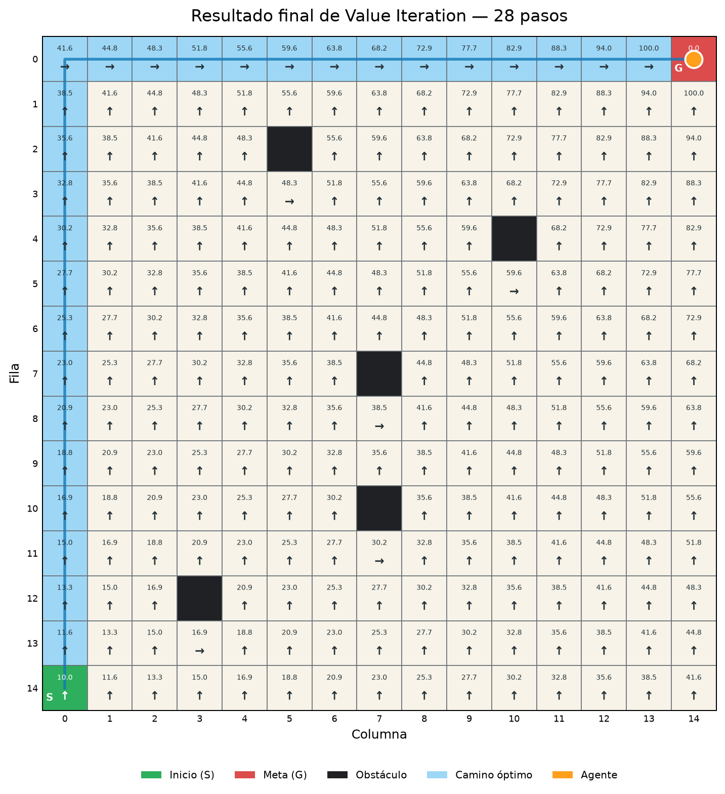

# Value Iteration en GridWorld 15×15

Este ejercicio implementa **Value Iteration** para resolver un GridWorld
determinista de 15×15. El agente parte de `(14, 0)`, evita cinco obstáculos y
busca una política óptima para llegar a la meta `(0, 14)`.

## Formulación como MDP

- **Estados:** las 225 celdas del tablero, excepto los obstáculos.
- **Acciones:** arriba, abajo, izquierda y derecha.
- **Transición:** determinista; una acción válida mueve una celda.
- **Recompensa de movimiento:** `-1`.
- **Movimiento inválido:** el agente permanece en su lugar y recibe `-5`.
- **Llegada a la meta:** recompensa `+100` y fin del episodio.
- **Descuento:** `gamma = 0.95`.

Los valores se actualizan con la ecuación de optimalidad de Bellman:

```text
V(s) ← max_a Σ_s' P(s'|s,a) [R(s,a,s') + γV(s')]
```

El algoritmo realiza barridos sincrónicos hasta que el cambio máximo entre dos
iteraciones consecutivas es menor que la tolerancia configurada. Después extrae
una política voraz y reconstruye el camino desde el inicio hasta la meta.

## Ejecutar

Mostrar el resultado final:

```powershell
.\.venv\Scripts\python.exe main.py
```

Mostrar la propagación de valores:

```powershell
.\.venv\Scripts\python.exe main.py --show-iterations --speed 0.15
```

Generar la imagen sin abrir una ventana:

```powershell
.\.venv\Scripts\python.exe main.py --no-gui
```

Consultar todas las opciones:

```powershell
.\.venv\Scripts\python.exe main.py --help
```

## Configuración predeterminada

| Parámetro | Valor |
|---|---:|
| Filas y columnas | 15×15 |
| Inicio | `(14, 0)` |
| Meta | `(0, 14)` |
| Obstáculos | 5 |
| Gamma | `0.95` |
| Tolerancia | `1e-8` |
| Máximo de iteraciones | 10 000 |

## Resultado verificado

| Métrica | Resultado |
|---|---:|
| Convergencia | 29 iteraciones |
| Longitud del camino | 28 pasos |
| Recompensa acumulada | 73 |
| Obstáculos atravesados | 0 |

El camino tiene la distancia Manhattan mínima posible entre inicio y meta. Si
aparecen varios caminos con el mismo valor, el desempate de acciones puede
seleccionar cualquiera de ellos sin perder optimalidad.



## Archivos principales

```text
main.py
gridworld/config.py
gridworld/environment.py
gridworld/value_iteration.py
gridworld/visualization.py
tests/test_environment.py
tests/test_value_iteration.py
```

## Pruebas

```powershell
.\.venv\Scripts\python.exe -m unittest tests.test_environment -v
.\.venv\Scripts\python.exe -m unittest tests.test_value_iteration -v
```

Las pruebas comprueban dimensiones, posiciones, obstáculos, transiciones,
recompensas, convergencia, optimalidad de Bellman, seguridad del camino y
generación de la figura en modo sin interfaz.

## Interpretación

Value Iteration funciona especialmente bien aquí porque el entorno es pequeño,
tabular, determinista y completamente conocido. Puede evaluar anticipadamente
todas las transiciones sin interactuar con un sistema externo. Cuando el modelo
es desconocido o muy grande, métodos como Q-Learning pueden ser más apropiados,
aunque necesitan experiencia y exploración.

